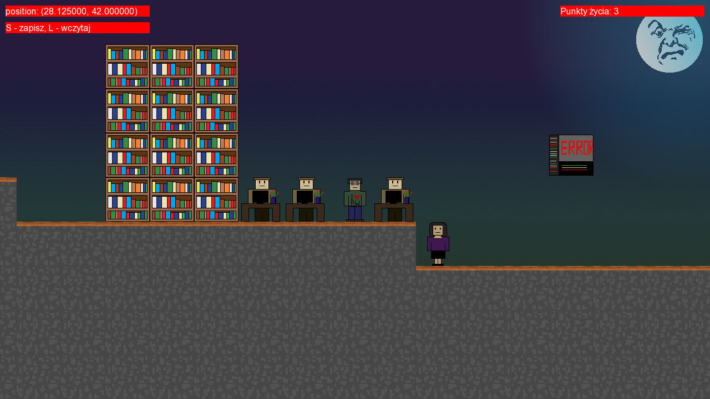
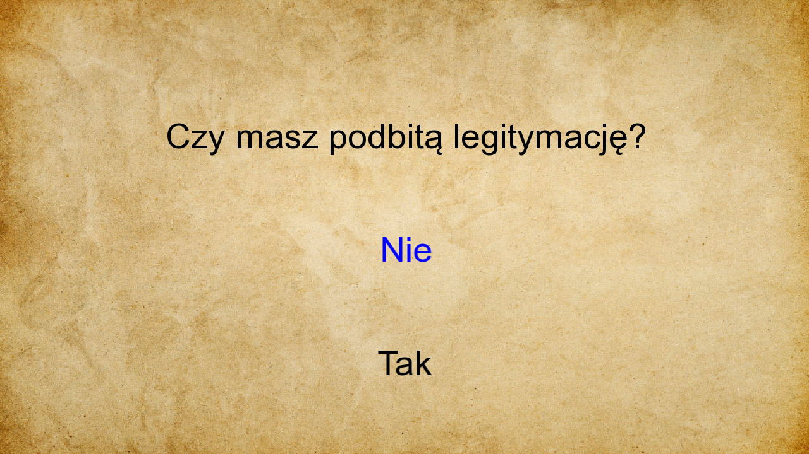

# Studencka Gra RPG

Gra RPG, taka trochę jak Diablo, ale z widokiem z 
boku (o ile nadal można mówić o Diablo w takim przypadku). 
Gracz (student) przechodzi przez mapę politechniki walcząc z potworami godnymi 
studiów. Celem gry jest zabicie wszystkich bossów i
przeżycie studiów.

# Opis techniczny

Studencka Gra RPG została stworzona w autorskim silniku 
do grafiki sprite'owej, który nie korzysta z SFMLowych 
sprite'ów ani żadnych gotowych rozwiązań. W jej ramach 
zaimplementowano scrollowany świat z płynnie poruszającą się 
kamerą. Gra napisana jest w C++20 i wykorzystuje najnowsze 
funkcjonalności tego języka.

# Demo gry

# Zrzuty ekranu

# Autorzy

Antoni Michał Przybylik
- Mechanika gry

Zoja Hordyńska
- Menu
- Quizy
- Tekstury
