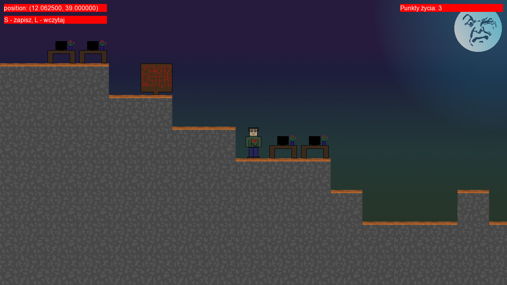

# Studencka Gra RPG

Gra RPG, taka trochę jak Diablo, ale z widokiem z 
boku (o ile nadal można mówić o Diablo w takim przypadku). 
Gracz (student) przechodzi przez mapę politechniki walcząc z potworami godnymi 
studiów. Celem gry jest zabicie wszystkich bossów i
przeżycie studiów.

# Opis techniczny

Studencka Gra RPG została stworzona w autorskim silniku 
do grafiki sprite'owej, który nie korzysta z SFMLowych 
sprite'ów ani żadnych gotowych rozwiązań. W jej ramach 
zaimplementowano scrollowany świat z płynnie poruszającą się 
kamerą. Gra napisana jest w C++20 i wykorzystuje najnowsze 
funkcjonalności tego języka.

# Kompilacja

Repozytorium należy sklonować korzystając z opcji `--recursive` żeby sklonowały się również podmoduły:
```bash
git clone https://github.com/antoniprzybylik/studencka_gra_rpg.git --recursive
```

Następnie należy wejść do katalogu z kodem gry i wykonać komendę `make build`:
```bash
cd studencka_gra_rpg/game/
make build
```

Zbudowana gra pojawi się w nowo utworzonym katalogu `application`.

# Wymagania

- SFML (wersja wcześniejsza niż 3.x, np. 2.6.2)
- Catch2 (wersja wcześniejsza niż 3.x, np. 2.13.9)
- libm (np. wersja 6)
- JSONCPP (np. wersja 26)

Uwaga: Silnik nie kompiluje się z SFML 3 ani Catch2 3. Trzeba użyć starszych wersji tych bibliotek.

# Demo gry


# Zrzuty ekranu




# Autorzy

Antoni Michał Przybylik
- Mechanika gry
- Zapisywanie i wczytywanie stanu gry z pliku

Zoja Hordyńska
- Menu
- Quizy
- Tekstury
